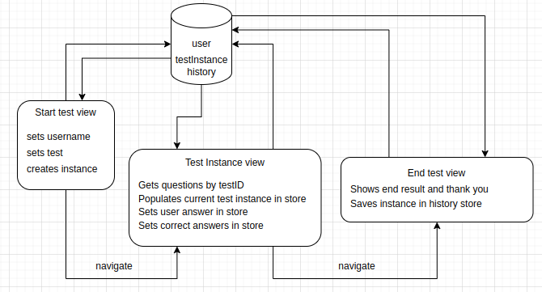

# Vendon assignment

A simple assessment system in which the user enters their name, chooses a test, executes
it, and at the end sees their result.

## Installation

1) in project root execute command `yarn` to install dependencies
2) then to start the local dev environment execute command `yarn dev`
Project will start in your default browser with port `5173`

* To execute tests - execute command `yarn test` (it will start in `--watch mode`)

## Main used tech stack

* react with vite
* typescript
* zustand (state management)
* tailwindcss
* vitest

## Overview

The test consists of 3 different views:
1) Homepage - the user enters their name and chooses one of the available tests
2) Assessment question view - each question has answer options. One of them is correct.
3) Result view - the user sees their result.

## Application flow

App flow starts with form which includes user input, test select and submit button. All fields ar required, and user will receive error message if something is missing.
To start assessment, new assessment instance object is created - it consists of chosen assessment id, user name, unique id, questions (empty array) and finished (flag).
At first render api call receives questions based on assessment id without correct answers - it prevents possibility to check correct answers in dev tools.
On each question submit - user answer id is store in question object result object. Submit answer button is protected from pressing without selected answer.
On assessment end api call receives correct answers for each question - and correct answer id is set in result object along user answer id.
The assessment end page shows thank you message with user name and overall result which consists of correct answer count and total.
assessment instance saves every time assessment ends.

"Under the hood" functionality description will be found in source code comments and in diagram below.



## Data model

App uses mock test data from tests.json file. Every request for this data is commented with start and end of block, where API function needs to be implemented in the future.

As this application will serve as testing app, the main aspect for data modeling i used, were restriction for assessment sensitive data to be available before and while assessment is in progress.

Full tests mock data structure:

```
{
    "id": number,
    "name": string,
    "questions": [
        {
            "id": number,
            "question": string,
            "answers": [
                {
                    id": number,
                    "answer": string,
                    "isCorrect": boolean
                },
                ...
            ]
        },
        ...
    ]
}
```

### Start assessment page

On starting page users have only tests to chose from, this implementation prevents users from accessing questions and answers as well.
```
Assessment {
    id: number;
    name: string;
}
```

### Assessment instance page

Assessment instance provides all questions and answers but without correct answer flag, this implementation prevents users from accessing correct answer information.

```
Assessment {
    id: number;
    name: string;
}

Question { 
    id: number;
    question: string;
    answers: Answer[];
    result?: UserAnswer;
}

Answer {
    id: number;
    answer: string;
}

AssessmentInstance {
    id: string;
    user: string;
    assessmentId: number;
    questions: Question[];
    finished: boolean;
}

UserAnswer extends Answer {
    userAnswerId: number;
    correctAnswerId?: number;
}
```

## Tests

Main functionality are covered with tests using vitest library

## TODO futures

Assessment instance model was developed with the idea in mind, that it could be usefull in must have future features such:

* Mistakes overview in the end of the assessment
* Users assessments history
* Assessments overview from history
* Assessments statistics and metrics
* Continue unfinished Assessments

